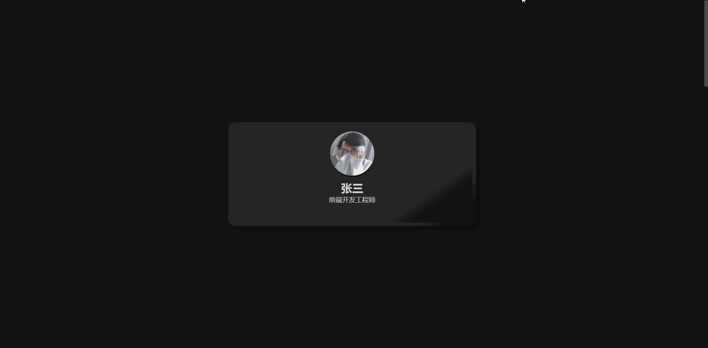
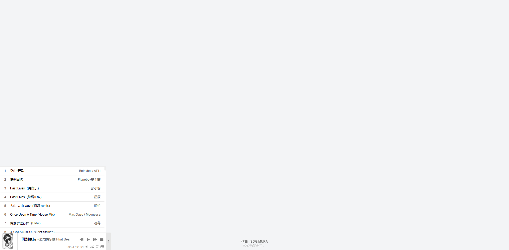

# html-lab

html labs 各种前端小案例使用

## 目前实现

+ 滚动条 [source-code](./component/scrollbar/index.html)
    

+ 暗黑个人主页 [source-code](./views/person/index.html)
    

+ 音乐播放器骨架 [source-code](./views/skeleton/Music_playback.html)
    

---

## 中间产物

[中间产物](tmp/README.md)

## 协议

> 似乎没有什么协议约束, MIT 许可
